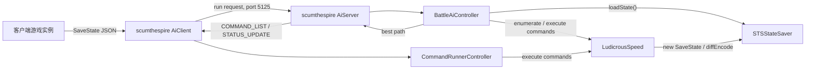

# 自动战斗模块说明

本文档说明 `STSStateSaver`、`LudicrousSpeed`、`scumthespire` 三个模块如何共同组成《杀戮尖塔》自动战斗功能。该能力基于 boardengineer 的同名开源项目体系继续集成和改进，目标是在本仓库中形成可构建、可审阅、可扩展的战斗搜索流水线。

## 范围

自动战斗只负责战斗内决策和执行，不覆盖地图、事件、商店、选卡等非战斗场景。非战斗决策由 `sts_ai_framework` 和 `selectcard` 负责。

自动战斗的核心问题是：在当前战斗状态下，快速枚举可执行命令，模拟命令序列的结果，选择一条高价值路径，并在客户端游戏实例中复现该路径。

## 模块总览

| 模块 | 主要职责 | 对自动战斗的贡献 |
|---|---|---|
| `STSStateSaver` | 捕获、序列化和恢复战斗状态 | 为搜索提供可回滚的状态快照，支持从任意模拟节点恢复 |
| `LudicrousSpeed` | 快速执行战斗动作和命令 | 替代正常动画驱动的动作循环，提供可枚举、可编码、可执行的命令接口 |
| `scumthespire` | 战斗 AI、网络协调和路径执行 | 在服务端搜索最优命令序列，在客户端接收并执行结果 |

三者之间的关系可以概括为：



## 架构设计

自动战斗采用双实例架构：

1. **客户端实例**：玩家正常看到的游戏进程，进入战斗后通过顶部按钮或自动启动逻辑发起请求。
2. **服务端实例**：通过 `java -DisServer=true -jar ModTheSpire.jar` 启动的无头搜索实例，接收客户端状态并执行大量快速模拟。

该设计避免在玩家可见实例中直接进行大量搜索。客户端只负责保存当前状态、发送请求、显示进度、执行服务端返回的命令序列。服务端负责加载状态、快速搜索、输出最终路径。

### 状态层：STSStateSaver

`STSStateSaver` 的核心类是 `savestate.SaveState`。它保存战斗恢复所需的关键字段，包括：

- 玩家状态：生命、能量、手牌、抽牌堆、弃牌堆、消耗堆、遗物、药水、能力、姿态、充能球。
- 怪物状态：怪物类型、生命、格挡、意图、移动历史、能力。
- 全局战斗状态：楼层、回合数、屏幕状态、随机数状态、当前地图节点、动作队列相关状态。
- 选择界面状态：`HAND_SELECT`、`GRID`、`CARD_REWARD` 等战斗中可能弹出的选择界面。
- 搜索辅助状态：本回合已打出的牌、本场战斗已打出的牌、已抽牌、回合结束队列标志等。

`SaveState` 提供三类关键能力：

| 能力 | 方法或结构 | 用途 |
|---|---|---|
| 完整编码 | `jsonEncode()` / `encode()` | 客户端将当前战斗写入 `startstates`，服务端从文件加载 |
| 状态恢复 | `loadState()` / `loadInitialState()` | 搜索节点回滚到某个分支起点 |
| 差异编码 | `diffEncode()` / `diff()` | 命令路径执行时校验客户端状态是否仍与服务端预测一致 |

本仓库中的状态层重点强化了搜索场景的可恢复性：`SaveState` 记录 `end_turn_queued`、`is_ending_turn`、`lesson_learned_count`、`parasite_count`、`grid_card_select_amount`、`lastCombatMetricKey` 等字段，并支持旧格式或缺失字段的兼容读取。这些字段减少了搜索回放和真实执行之间的偏差。

### 模拟层：LudicrousSpeed

`LudicrousSpeed` 通过 `ludicrousspeed.Controller` 接口把外部控制器接入游戏动作循环。核心入口是 `ActionSimulator.actionLoop()`：它在阻塞循环中持续推进动作队列，并在游戏等待用户输入时调用控制器的 `step()`。

该模块承担两项职责：

1. **加速游戏内部动作**：跳过或压缩动画、音效、等待时间、渲染相关逻辑，让战斗状态尽快推进到下一个可决策点。
2. **抽象可执行命令**：用 `Command` 接口统一表示打牌、用药水、结束回合和选择界面操作。

主要命令包括：

| 命令 | 用途 |
|---|---|
| `CardCommand` | 打出指定手牌，可带怪物目标 |
| `PotionCommand` | 使用指定药水，可带怪物目标 |
| `EndCommand` | 结束当前回合 |
| `HandSelectCommand` / `HandSelectConfirmCommand` | 处理手牌选择界面 |
| `GridSelectCommand` / `GridSelectConfrimCommand` | 处理网格选择界面 |
| `CardRewardSelectCommand` | 处理战斗中的卡牌奖励选择 |

`CommandList.getAvailableCommands()` 会根据当前状态枚举合法命令，并对重复命令做去重。它覆盖普通出牌、药水、结束回合，以及战斗中由卡牌效果触发的选择界面。命令都可以编码为 JSON，便于服务端返回路径并由客户端复现。

### 搜索层：scumthespire

`scumthespire` 是自动战斗的决策层，Mod 名称为 `BattleAiMod`。它包含三个子系统：

| 子系统 | 核心类 | 说明 |
|---|---|---|
| Mod 入口和运行模式 | `BattleAiMod` | 注册 BaseMod 钩子、顶部按钮、服务端模式、客户端模式、速度补丁 |
| 搜索控制 | `BattleAiController`、`TurnNode`、`StateNode` | 加载状态、枚举命令、模拟分支、按价值排序回合节点 |
| 网络和复现 | `AiServer`、`AiClient`、`CommandRunnerController` | 传输状态与命令路径，客户端执行服务端结果 |

搜索不是简单地枚举固定深度的动作序列，而是以回合为单位维护优先队列：

1. `BattleAiController` 从客户端提交的 `SaveState` 初始化根节点。
2. `TurnNode` 表示一个回合起点，按 `ValueFunctions.caclculateTurnScore()` 排序。
3. `StateNode` 表示执行某个命令后的中间状态，内部维护可执行命令列表。
4. 每个 `StateNode` 通过 `CommandList` 枚举下一步动作，再由 `LudicrousSpeed` 执行并生成新状态。
5. 当路径进入新回合、胜利、死亡或达到搜索阈值时，控制器更新候选结果。
6. 找到胜利路径时返回最佳命令序列；找不到但已有可提交的部分进展时，回放到最佳回合后自动重新规划；完全无进展时返回最晚死亡路径（`stop_reason: ALL_LOSE`），让角色战死、对局正常结束，从而与框架的自动重开衔接，避免客户端停在等待出牌界面。

搜索在新回合边界使用完整 `SaveState` 的规范化状态键去重。状态键保留 RNG、牌实例、
出牌历史、选择界面和扩展状态，因此不会仅凭卡名或出牌集合合并顺序敏感的路径。

搜索预算提供三个档位：`FAST`（5,000 次扩展/10 秒）、`BALANCED`（15,000 次扩展/30 秒，
默认）和 `DEEP`（50,000 次扩展/90 秒）。快速和均衡档继续流式提交已经冻结的路径前缀；
深入档等待本段搜索结束后再执行。预算耗尽但尚未获胜时，客户端执行最佳下一回合路径并
自动从新状态重新规划。

`StateNode` 还会使用角色和动作相关启发式调整命令顺序，例如：

- 铁甲战士、静默猎手、故障机器人卡牌出牌顺序。
- 丢弃、消耗、复制、梦魇等选择动作的卡牌排序。
- 对特定卡牌组合做优先或延后处理，例如 `Dropkick`、`Heel Hook`、`Catalyst`、`Turbo`。

## 模块间协作流程

### 发起请求

客户端进入战斗后，`AiClient.sendState()` 创建 `SaveState`，将完整 JSON 写入：

```text
startstates/<seed>/<floor>/<index>/start.txt
```

随后客户端向 `AiServer` 发送运行请求，内容包含：

- `fileName`：起始状态文件的绝对路径。
- `num_turns`：搜索预算。
- `command_file`：服务端必要时写入完整命令结果的路径。
- `client_cwd`：客户端工作目录，用于写入相对状态 diff 文件。

### 服务端搜索

服务端读取起始状态，调用 `SaveState.initPlayerAndCardPool()` 初始化卡牌池，再创建 `BattleAiController`。搜索过程中：

- 每个分支通过 `SaveState.loadState()` 回滚。
- 每一步通过 `Command.execute()` 推进状态。
- 新状态通过 `new SaveState()` 捕获。
- 回合节点通过 `ValueFunctions` 排序。
- 进度通过 `STATUS_UPDATE` 返回给客户端。

### 返回和执行命令

搜索完成后，服务端将最优路径转换为命令数组。每个命令包含：

- `command`：JSON 编码后的命令。
- `state`：可选的差异状态文件路径，用于客户端执行前校验。

客户端收到 `COMMAND_LIST` 后创建或更新 `CommandRunnerController`。该控制器逐条执行命令，并支持在服务端仍在搜索时接受更优的后续路径。若更新后的路径与已消耗命令不兼容，会触发 `LudicrousSpeedMod.mustRestart`，避免继续执行已经偏离的预测路径。

## 本仓库集成改进点

本仓库沿用 boardengineer 项目的三模块分层，但围绕可维护性和稳定运行做了集成整理：

- **统一仓库组织**：`STSStateSaver`、`LudicrousSpeed`、`scumthespire` 与主 AI 框架并列维护，根目录 README 和本文件提供统一入口。
- **统一构建顺序**：`build_all.sh` 按依赖顺序构建 `STSStateSaver`、`LudicrousSpeed`、`StSCommunicationMod`、`scumthespire`。
- **状态兼容性增强**：`SaveState` 对可选字段和旧字段提供默认值读取，并补充回合结束、选择界面、特殊计数等搜索关键字段。
- **差异状态校验**：服务端可沿命令路径写入 `diffEncode()` 结果，客户端执行命令前用 `SaveState.diff()` 比对预测状态和真实状态。
- **客户端/服务端容错**：`AiClient` 使用连接和读取超时，断连时清理客户端控制器；`AiServer` 解析失败或连接中断时清理服务端状态。
- **命令路径热更新**：`CommandRunnerController` 可在已执行部分路径后接收新路径，并校验新旧路径前缀一致。
- **全败死亡路径兜底**：搜索不存在胜利路线且无可提交进展时，`BattleAiController.noWinFallback()` 改用记录的存活最久死亡线（`deathNode`）作为下发路径，战斗正常打完并以死亡收场。
- **命令枚举去重**：`CommandList` 对可重复编码的卡牌命令和同名药水命令做去重，降低无意义分支。
- **选择界面覆盖**：命令系统覆盖手牌选择、网格选择、卡牌奖励选择，减少搜索在战斗中间 UI 上停滞的概率。
- **可选预测集成**：`BattleAiController` 在检测到 `FightPredictor` 时读取预测伤害并异步生成参考预测，不将其作为硬依赖。

## 构建和运行

首次运行前，需要将游戏和 Mod 依赖放入本仓库约定目录：

```bash
mkdir -p lib _ModTheSpire/mods
cp "D:/Program Files/Slay the Spire/desktop-1.0.jar" lib/
cp "D:/Program Files/Slay the Spire/ModTheSpire.jar" lib/
cp "D:/Program Files/Slay the Spire/mods/BaseMod.jar" _ModTheSpire/mods/
cp "D:/Program Files/Slay the Spire/mods/StSLib.jar" _ModTheSpire/mods/
```

只构建本文聚焦的三个自动战斗模块时，按依赖顺序运行：

```bash
cd STSStateSaver && mvn package
cd LudicrousSpeed && mvn package
cd scumthespire && mvn package
```

如果要构建本仓库完整 Java Mod 组合，则从仓库根目录运行。该脚本还会构建 `StSCommunicationMod`，以保持 README 中的完整运行配置一致：

```bash
./build_all.sh
```

运行自动战斗：

1. 在游戏根目录创建 `savestates` 和 `startstates` 空目录。
2. 启动服务端实例：`java -DisServer=true -jar ModTheSpire.jar`。
3. 启动普通客户端实例，并启用相关 Mod。
4. 进入战斗后点击顶部的 "Start Steve" 按钮，或在配置中启用自动启动。

## 扩展建议

扩展自动战斗时，应优先确认变更属于哪一层：

- 新卡牌、新遗物、新怪物或新动作无法恢复：优先扩展 `STSStateSaver` 的状态工厂和对应状态类。
- 合法操作没有被搜索到：优先扩展 `LudicrousSpeed` 的 `Command` 或 `CommandList`。
- 搜索路径质量差：优先调整 `scumthespire` 的 `ValueFunctions`、角色出牌启发式或 `StateNode.populateCommands()`。
- 客户端执行与服务端预测不一致：优先检查 `diffEncode()` 字段、命令编码和 `CommandRunnerController` 的路径兼容性。

## 参考

- boardengineer/scumthespire: https://github.com/boardengineer/scumthespire
- boardengineer/LudicrousSpeed: https://github.com/boardengineer/LudicrousSpeed
- boardengineer/STSStateSaver: https://github.com/boardengineer/STSStateSaver
