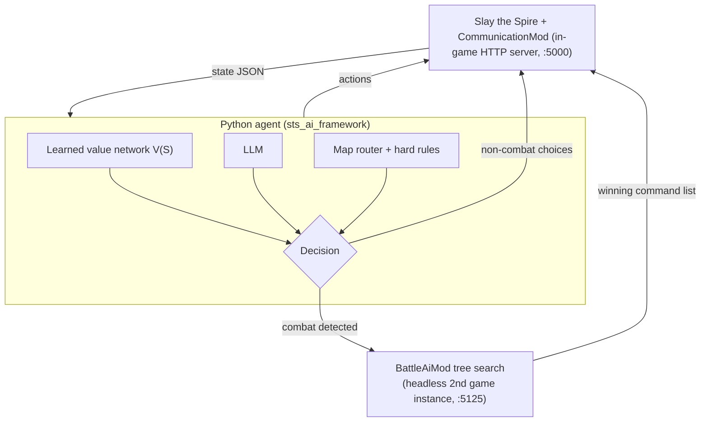

# AIPlaySpire

**English · [简体中文](README.zh-CN.md)**

An end-to-end AI agent that plays complete runs of **Slay the Spire** — combining a learned, permutation-invariant state-value model, an LLM, and a combat tree-search engine to make every in-run decision.

> **Ascension-10 evaluation (n = 20 randomly seeded runs):** AIPlaySpire **reached the final boss in 90% of runs** and posted **~2× the average floor progression** of an LLM-only agent on the *identical seeds*.
>
> _Reaching the final boss is not a win rate — see [Evaluation](#evaluation)._

---

## Evaluation

| Method | Final-boss reach rate (A10) | Avg floor progression (same seeds) |
|---|---|---|
| **AIPlaySpire** | **90%** | **~2.0×** (LLM-only baseline) |
| LLM-only baseline | — | 1.0× |

Protocol:

- **Difficulty:** Ascension 10 (A10). **20 runs** with randomly drawn seeds.
- **Paired comparison:** the LLM-only baseline plays the same 20 seeds, so each pair shares identical game RNG.
- **"Reached the final boss"** is defined as reaching the Act 3 boss room, or the Corrupt Heart on runs that take the Heart route. It measures survival/progression — *not* victory rate.
- **n = 20** is a small sample; treat the results as directional evidence. The baseline reach rate is not yet recorded, hence "—".

Because both agents run the identical seeds, the floor-progression gap is a paired measurement, not seed luck. The project's core thesis is that long-horizon decisions need a learned value function rather than text generation; the paired protocol exists to test that claim, and the sample size will grow as more evaluation runs are recorded.

## Overview

AIPlaySpire is a hybrid agent that plays a whole run on its own: it routes the map, chooses cards and relics, buys from shops, resolves events, rests at campfires, collects the keys that unlock Act 4, and plays every combat — no human input after the run starts.

Plain LLM prompting is a poor fit for Slay the Spire's decision structure, so the agent splits decisions into three regimes:

1. **Long-horizon, enumerable decisions** — card rewards, purchases, removals, upgrades, boss relics, event branches. Each candidate can be applied to the current state and scored, but its true value only shows up acts later. A **learned value function** V(S) — trained on ~157M decision states replayed from 13.4M validated recorded runs — provides the long-horizon comparison; candidates are evaluated as hypothetical next-states (enumerate → simulate → argmax V).
2. **Combat** — exact, deterministic, and cheap to run once game state is serialized. A **best-first tree search** explores card-play/targeting/potion sequences on an accelerated copy of the real game engine, with budgets up to 50k branch expansions per turn.
3. **Everything unstructured** — rare screens, legacy payloads, novel situations. An **LLM** with a structured-output contract acts as the general reasoning fallback, and deterministic rules handle the few decisions that have a provably correct answer (opening chests, claiming key relics).

## System Architecture


*End-to-end system architecture: game-side Java mods, the Python agent, the learned value model, and the combat search pipeline.*



Components:

- **CommunicationMod** (`StSCommunicationMod/`) — Java mod that exposes the live game over HTTP (`/state`, `/action`, `/card_info`): full state JSON with structured event semantics (~50 vanilla events classified as forced/deterministic/complex), grid and reward metadata, and executable actions submitted through the real game UI.
- **sts_ai_framework/** — Python agent loop: polls state, classifies the screen, picks a decision path, submits one action, and verifies it actually took effect (retry / fallback otherwise).
- **BattleAiMod** (`scumthespire/`) — combat AI owned by a separate headless game instance, coordinated with the visible client through `STSStateSaver` (full combat-state serialization incl. RNG) and `LudicrousSpeed` (blocking, animation-free engine execution). The combat mods in this repo are forked from [boardengineer](https://github.com/boardengineer)'s open-source mods and substantially extended here (tactical turn evaluation, search budgets, replay verification); see [AUTOFIGHT.md](AUTOFIGHT.md) for the full design.

## Learned Value Model

The core of the project is **STSValueNetwork** (`selectcard/`) — a ~0.7M-parameter Set Transformer that predicts how far a run will go from any non-combat state.

**Input — an unordered set of deck cards and relics.** Each unique item (card/relic ID, upgrade level) becomes one token by summing an ID embedding, an upgrade embedding, and a count embedding; identical cards are aggregated, so a 5× Strike is one token with count 5.

```
[CLS] + [GLOBAL] + [BOSS] + item_1 ... item_n
```

- **[CLS]** — pooled at the output for prediction.
- **[GLOBAL]** — engineered features (act one-hot + progress, HP ratio/absolute, gold, ascension) through an MLP.
- **[BOSS]** — embedding of the *visible* boss of the current act (public info once the map is revealed), added to a learned boss-context token.
- **No positional encoding.** Decks and relics are sets — permutation invariance is deliberate, not an omission. Pre-LayerNorm transformer blocks follow, then CLS pooling into the prediction head.

**Output — a stopping-hazard distribution, not a single survival label.** The head emits 20 logits, one per floor bucket (~every 2–3 floors from floor 3 to 57), each the conditional risk that the run *stops before* that endpoint, plus one conditional logit for winning the Heart fight. The survival curve is the cumulative product of (1 − hazard), which makes monotone long-horizon survival a built-in structural constraint:

```
hazard composition → survival S(F) → E[terminal floor] + β·P(Heart)   (β = 3 floor-equivalents, normalized by 57 + β)
```

The result is a single scalar **V(S)** used for action comparison. Trained on censored as well as completed runs (a run that dies at floor 40 labels only the buckets it actually reached), with per-bucket hazard targets and ascension-band-balanced weighting, so A0–A20 all contribute equally.

**How it decides:** for every candidate (pick this card, buy this relic, remove that card, smith that card, take this event branch), the agent applies the change to the current state, re-encodes, and scores V — the best-scoring hypothetical state wins. This is why the model is invoked in-process at decision time rather than as an offline predictor.

**Offline validation** (held-out test split, from `selectcard/checkpoints/` test logs):

- Trained on ~126M train states, sampled from a 20.3M-run corpus of recorded vanilla runs of which 13.4M passed replay-based validation (exact deck/relic reconstruction against the end-of-run log; content cross-checked against a decompiled vanilla catalog).
- Expected-terminal-floor MAE of **~8.4 floors** vs ~9.9 for a constant-hazard baseline, on test states with fully observed outcomes.
- Heart-win prediction AUROC ≈ **0.89** on the same test states.

## Decision Pipeline

Every decision in a run is owned by exactly one mechanism:

| Decision | Mechanism |
|---|---|
| Card rewards, generated-card grids (pick / skip) | Value network (per-candidate V(S)) |
| Shop purchases | Value network (evaluates each purchasable item; buys while V improves) |
| Campfire: rest / smith / dig / lift | Value network, incl. per-card ranking of the smith target; Act-3 Ruby-key rule overrides |
| Events (structured semantics) | Value network for deterministic-effect branches; conservative rules for high HP-risk events; dedicated multi-step flow for the Cursed Tome |
| Card remove / upgrade / transform / duplicate grids | Value network ranks target cards (curse-aware for transforms) |
| Boss relics | Value network |
| Combat rewards | Fixed priority (relic > gold > potion > card) + structured Emerald/Sapphire key claims with value-based key-vs-relic tradeoff |
| Chests | Auto-open |
| **Map routing** | **Deterministic HP-aware router** — room-value scoring, rest-vs-elite risk vs current HP, 1-step lookahead, Act-2 elite HP buffer; LLM only as fallback on partial payloads |
| **Combat** (card plays, targeting, potions, end-turn, in-combat selections) | **BattleAiMod best-first tree search** on the real (fast-forwarded) engine; turn nodes prioritized by a hand-tuned tactical evaluator (threat, survival bands, lethal breakpoints); budgets 5k–50k expansions; result replayed command-by-command with per-step state-diff verification |
| Novel / unstructured screens | LLM with JSON-output contract + safe-action fallback chain |

The design rule of thumb: **if a decision can be enumerated and needs long-horizon value → value network; if it is exact and reversible → search; if it is ambiguous or new → LLM.** The LLM is the last resort, not the default brain.

## Repository Structure

| Directory | Role |
|---|---|
| `sts_ai_framework/` | Python agent: state polling, decision dispatch, LLM client, run logging ([README](sts_ai_framework/README.md)) |
| `selectcard/` | PyTorch project for the Set Transformer value network: replay-based data pipeline, training, inference engine ([README](selectcard/README.md)) |
| `StSCommunicationMod/` | Java mod: in-game HTTP bridge exposing state JSON and executing actions |
| `STSStateSaver/` | Java mod: full combat-state serialization/restore (incl. RNG) — the search rewind primitive |
| `LudicrousSpeed/` | Java mod: animation-free, blocking execution of the real game engine + command interface |
| `scumthespire/` | Java mod ("Battle Ai Mod"): combat tree search, tactical evaluator, client/server networking |
| `cardcrawl/` | Decompiled vanilla game source — used as the read-only content catalog for data validation |

Architecture and run instructions for the combat pipeline (two game instances, search budgets, mod build order via `./build_all.sh`) are documented in [AUTOFIGHT.md](AUTOFIGHT.md). Note: a few repository docs are in Chinese.

## Training the Value Network

```bash
cd selectcard

# 1. Process raw run archives (JSON) into labeled Parquet states (replay + validation)
python src/data_pipeline.py

# 2. Train (v2-style checkpoint embeds config, vocabulary, and normalization)
python src/train.py

# 3. Evaluate the best checkpoint on the held-out test split
python src/train.py --test-only

# 4. Optional: serve the same engine over HTTP for external callers
uvicorn src.api:app --reload      # POST /recommend/choice, /recommend/shop
```

Model unit tests: `python -m unittest test_value_network_v2.py` (from `selectcard/src/`).

## Quick Start

**Prerequisites:** Slay the Spire, ModTheSpire + BaseMod, Java 8+, Python 3.10+ (PyTorch for the model), and a DeepSeek/OpenAI-compatible API key for the LLM fallback.

```bash
# 1. Build the game mods (Maven) — full build order in AUTOFIGHT.md / build_all.sh
./build_all.sh        # → jars in _ModTheSpire/mods/

# 2. Launch the game via ModTheSpire with BaseMod + CommunicationMod (+ combat mods)
#    → the mod starts its HTTP bridge on localhost:5000

# 3. Python agent
pip install -r sts_ai_framework/requirements.txt   # + PyTorch/pandas/fastapi for selectcard (see its README)
# create sts_ai_framework/.env with: STS_API_BASE_URL=http://localhost:5000
#   LLM_MODEL=<model>  DEEPSEEK_API_KEY=<key>   (key list in sts_ai_framework/README.md)
python -m sts_ai_framework --interval 2.0
```

For the combat pipeline (headless search instance, save-state dirs, BattleAiMod activation in fights) follow [AUTOFIGHT.md](AUTOFIGHT.md).

## Tech Stack

**Python** — agent loop, HTTP client, JSON state models · **PyTorch** — Set Transformer value network, replay data pipeline (pandas/Parquet) · **Transformers** — custom permutation-invariant Set Attention blocks, Pre-LN, no positional encoding · **FastAPI** — optional inference server · **LLM API** — OpenAI-compatible chat completions (DeepSeek), JSON-output prompting, used as reasoning fallback · **Java** — four game mods (Maven), in-game HTTP server (JDK `HttpServer`) · **Tree search** — best-first over turn nodes with expansion budgets, executed on the real game engine · **Custom game modding** — ModTheSpire/BaseMod patching, UI event simulation, state serialization.

## Project Status

Experimental research-engineering project under active iteration; event coverage, combat-search robustness, and value-model quality are the main work areas.

**Attribution and disclaimers:** Slay the Spire is a game by Mega Crit — this project is an unofficial research effort, unaffiliated with Mega Crit. The combat-search mods (`STSStateSaver`, `LudicrousSpeed`, `scumthespire`) are derived from [boardengineer](https://github.com/boardengineer)'s open-source mods of the same names and have been extended here (tactical evaluator, search-budget profiles, replay/state-diff verification, server auto-spawn, recall support).
