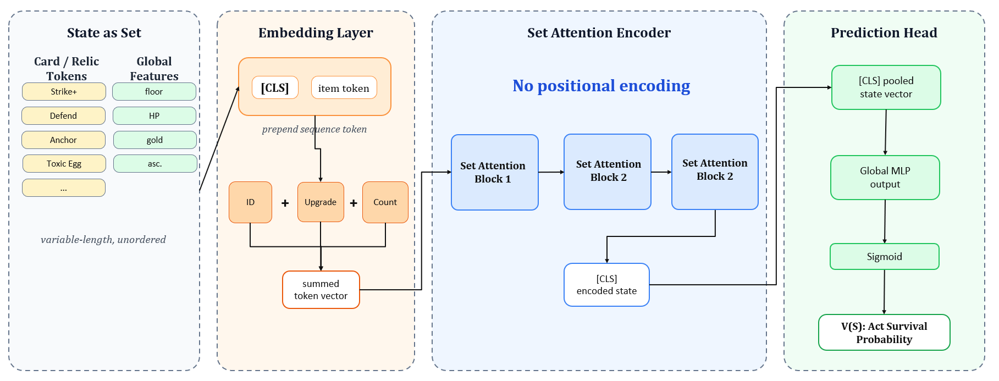
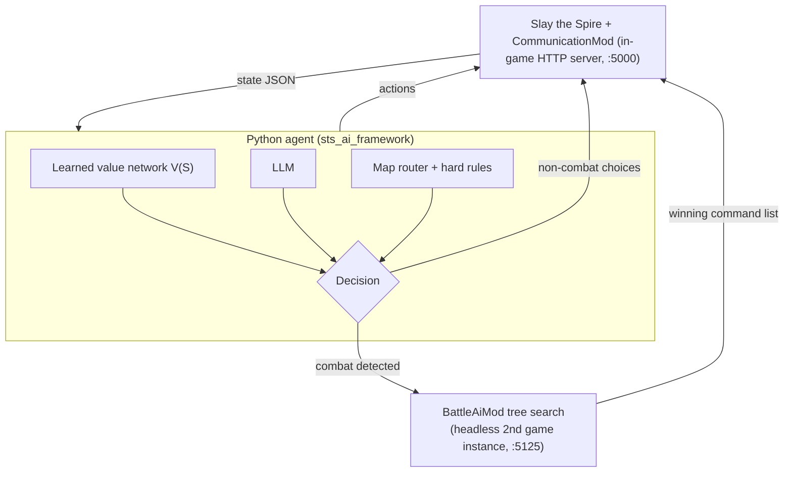

# AIPlaySpire

**[English](README.md) · 简体中文**

一个端到端自动游玩《杀戮尖塔》(Slay the Spire) 的 AI agent —— 结合学得的、排列不变的状态价值模型 (learned state-value model)、LLM 与战斗树搜索引擎，接管一局游戏中的每一个决策。

## 概览

AIPlaySpire 是一个混合架构 agent，可以独立完成整局游戏：规划地图路线、选择卡牌与遗物、商店购物、处理事件、在营火休息、收集解锁 Act 4 的三把钥匙，并打完每一场战斗 —— 开局后无需人工干预。

纯 LLM 提示难以适配《杀戮尖塔》的决策结构，因此 agent 将决策划分为三类机制：

1. **长时程、可枚举的决策** —— 选卡、购买、删牌、升级、Boss 遗物、事件分支。每个候选动作都可以作用在当前状态上打分，但其真正价值要数幕之后才显现。**学得的价值函数** V(S) —— 由 1340 万局通过校验的存档对局重放出的约 1.57 亿个决策状态训练而成 —— 提供长时程比较；候选通过"枚举 → 模拟 → argmax V" 的假设下一状态进行评估。
2. **战斗** —— 状态一旦序列化，转移是精确、确定且廉价的。**最佳优先树搜索**在加速后的真实游戏引擎上探索出牌/目标/药水的动作序列，每回合扩展预算最高 5 万分支。
3. **其余非结构化情况** —— 罕见界面、旧版 payload、新场景。**LLM** 以结构化输出契约为通用推理兜底；少数有确定最优解的决策（开宝箱、拿钥匙遗物）由硬编码规则处理。

## 系统架构



*端到端系统架构：游戏侧 Java mod、Python agent、学得的价值模型与战斗搜索流水线。*



组件：

- **CommunicationMod**（`StSCommunicationMod/`）—— Java mod，通过 HTTP 暴露实时游戏状态（`/state`、`/action`、`/card_info`）：完整状态 JSON，含结构化事件语义（约 50 个原版事件，分类为 forced/deterministic/complex）、选卡格与奖励元数据，以及经由真实游戏 UI 提交的可执行动作。
- **sts_ai_framework/** —— Python agent 主循环：轮询状态 → 识别屏幕类型 → 选择决策路径 → 提交单个动作 → 校验动作是否生效（否则重试/回退）。
- **BattleAiMod**（`scumthespire/`）—— 战斗 AI 由独立的无头游戏实例负责，通过 `STSStateSaver`（完整战斗状态序列化，含 RNG）与 `LudicrousSpeed`（阻塞式、去除动画的引擎执行）与可见客户端协同。仓库中的战斗 mod 源自 [boardengineer](https://github.com/boardengineer) 的开源同名 mod，并在本仓库中做了大量扩展（战术回合评估、搜索预算、重放校验）；完整设计见 [AUTOFIGHT.md](AUTOFIGHT.md)。

## 学得的价值模型

项目的核心是 **STSValueNetwork**（`selectcard/`）—— 一个约 **0.7M 参数**的 Set Transformer，用于预测任意非战斗状态能走到多远。

**输入 —— 牌组与遗物构成的无序集合。** 每个唯一条目（卡牌/遗物 ID + 升级等级）通过 ID embedding + 升级 embedding + 数量 embedding 求和成为一个 token；相同卡牌聚合，因此 5× Strike 是一个 count=5 的 token。

```
[CLS] + [GLOBAL] + [BOSS] + item_1 ... item_n
```

- **[CLS]** —— 输出端池化，用于预测。
- **[GLOBAL]** —— 工程化全局特征（幕 one-hot + 幕内进度、HP 比例/绝对值、金币、进阶等级），经 MLP 编码。
- **[BOSS]** —— 当前幕*可见* Boss（地图揭示后即为公开信息）的 embedding，与学得的 Boss 上下文 token 相加。
- **不使用位置编码。** 牌组与遗物是集合 —— 排列不变性是刻意设计而非省略。其后为 Pre-LayerNorm 的 Transformer 块，再经 CLS 池化进入预测头。

**输出 —— 停驻风险分布 (stopping-hazard)，而非单一存活标签。** 预测头输出 20 个 logit，对应约 3–57 层之间每隔 2–3 层的楼层桶，每个 logit 表示该 run 在到达该端点*之前*停驻的条件风险；另加 1 个战胜腐化之心的条件 logit。存活曲线由 (1 − hazard) 的累乘得到，单调的长时程存活成为内建的结构约束：

```
hazard 组合 → 存活曲线 S(F) → E[终止楼层] + β·P(Heart)   （β = 3 层等价，除以 57 + β 归一化）
```

最终得到用于动作比较的标量 **V(S)**。训练同时使用删失（中途死亡）与完整对局（第 40 层死亡的对局只标注其实际到达过的桶），配合逐桶 hazard 目标与按进阶段 (ascension band) 平衡的加权，使 A0–A20 各难度对训练贡献均衡。

**它如何做决策：** 对每个候选（拿这张卡、买这个遗物、删那张牌、敲哪张牌、走这个事件分支），agent 将变更作用到当前状态、重新编码并打分 V —— 得分最高的假设状态胜出。这也是模型在决策时以进程内方式被调用、而非作为离线预测器的原因。

**离线验证**（留出测试集，数据见 `selectcard/checkpoints/` 测试日志）：

- 训练状态约 **1.26 亿**，采样自 **2030 万局**记录存档语料（仅原版内容），其中 **1340 万局**通过重放式校验（对照局末日志精确重建牌组/遗物；内容对照反编译的原版目录交叉核查）。
- 期望终止楼层 MAE **约 8.4 层** vs 常数风险 baseline 约 9.9 层（在结局完全可观测的测试状态上）。
- 腐化之心预测 AUROC ≈ **0.89**（同一批测试状态）。

## 决策流水线

一局游戏中的每类决策都恰好由一个机制负责：

| 决策 | 机制 |
|---|---|
| 选卡奖励、生成卡牌格（拿/跳过） | 价值网络（逐候选 V(S)） |
| 商店购买 | 价值网络（逐个评估商品，购买至 V 不再提升） |
| 营火：休息 / 锻造 / 挖掘 / 举重 | 价值网络，含逐卡排名选出锻造目标；Act 3 红钥匙规则优先 |
| 事件（结构化语义） | 确定性效果分支交给价值网络；高风险 HP 事件用保守规则；诅咒之书 (Cursed Tome) 有专用多步流程 |
| 删卡 / 升级 / 变换 / 复制格子 | 价值网络对目标卡排名（变换时排除诅咒） |
| Boss 遗物 | 价值网络 |
| 战斗奖励 | 固定优先级（遗物 > 金币 > 药水 > 卡牌）+ 结构化翡翠/蓝宝石钥匙认领，钥匙与遗物的取舍由价值模型决策 |
| 宝箱 | 自动开启 |
| **地图路由** | **确定性 HP 感知路由器** —— 房间价值打分、结合当前 HP 权衡休息 vs 精英、1 步前瞻、Act 2 精英 HP 缓冲；仅对不完整 payload 回退 LLM |
| **战斗**（出牌、目标选择、药水、结束回合、战斗内选择） | **BattleAiMod 最佳优先树搜索**，跑在真实（快进）引擎上；回合节点由人工调校的战术评估器（威胁、生存区间、致死断点）排序；预算 5k–50k 次扩展；结果以命令序列逐条回放，并带逐步状态 diff 校验 |
| 陌生 / 非结构化界面 | LLM + JSON 输出契约 + 安全动作回退链 |

设计准则：**能枚举且需要长时程价值 → 价值网络；精确且可回滚 → 搜索；模糊或前所未见 → LLM。** LLM 是最后的兜底，而不是默认大脑。

## 仓库结构

| 目录 | 职责 |
|---|---|
| `sts_ai_framework/` | Python agent：状态轮询、决策分发、LLM 客户端、运行日志（[README](sts_ai_framework/README.md)） |
| `selectcard/` | Set Transformer 价值网络的 PyTorch 工程：基于重放的数据流水线、训练、推理引擎（[README](selectcard/README.md)） |
| `StSCommunicationMod/` | Java mod：游戏内 HTTP 桥，暴露状态 JSON 并执行动作 |
| `STSStateSaver/` | Java mod：完整战斗状态序列化/恢复（含 RNG）—— 搜索回滚的原语 |
| `LudicrousSpeed/` | Java mod：无动画、阻塞式地执行真实游戏引擎 + 命令接口 |
| `scumthespire/` | Java mod（"Battle Ai Mod"）：战斗树搜索、战术评估器、客户端/服务端网络 |
| `cardcrawl/` | 反编译的原版游戏源码 —— 作为数据校验的只读内容目录 |

战斗流水线（双游戏实例、搜索预算、`./build_all.sh` 的 mod 构建顺序）的架构与运行说明见 [AUTOFIGHT.md](AUTOFIGHT.md)。注：仓库部分文档为中文。

## 训练价值网络

```bash
cd selectcard

# 1. 原始对局存档 (JSON) → 带标签的 Parquet 状态（重放 + 校验）
python src/data_pipeline.py

# 2. 训练（v2 式 checkpoint 内嵌配置、词表与归一化统计）
python src/train.py

# 3. 在留出测试集上评估最佳 checkpoint
python src/train.py --test-only

# 4. 可选：以 HTTP 对外提供同一推理引擎
uvicorn src.api:app --reload      # POST /recommend/choice, /recommend/shop
```

模型单元测试：在 `selectcard/src/` 下运行 `python -m unittest test_value_network_v2.py`。

## 快速开始

**前置条件：** 《杀戮尖塔》游戏本体、ModTheSpire + BaseMod、Java 8+、Python 3.10+（模型需 PyTorch）、LLM 兜底需要 DeepSeek/OpenAI 兼容 API key。

```bash
# 1. 构建游戏 mod（Maven）—— 完整构建顺序见 AUTOFIGHT.md / build_all.sh
./build_all.sh        # → 产物在 _ModTheSpire/mods/

# 2. 通过 ModTheSpire 启动游戏，勾选 BaseMod + CommunicationMod（+ 战斗 mod）
#    → mod 在 localhost:5000 启动 HTTP 桥

# 3. Python agent
pip install -r sts_ai_framework/requirements.txt   # selectcard 另需 PyTorch/pandas/fastapi（见其 README）
# 创建 sts_ai_framework/.env，写入：STS_API_BASE_URL=http://localhost:5000
#   LLM_MODEL=<模型>  DEEPSEEK_API_KEY=<key>   （字段清单见 sts_ai_framework/README.md）
python -m sts_ai_framework --interval 2.0
```

战斗流水线（无头搜索实例、存档目录、战斗内激活 BattleAiMod）请按 [AUTOFIGHT.md](AUTOFIGHT.md) 操作。

## 技术栈

**Python** —— agent 主循环、HTTP 客户端、JSON 状态模型 · **PyTorch** —— Set Transformer 价值网络、重放式数据流水线（pandas/Parquet） · **Transformer** —— 自研排列不变 Set Attention 块、Pre-LN、无位置编码 · **FastAPI** —— 可选的推理服务 · **LLM API** —— OpenAI 兼容 chat completions（DeepSeek），JSON 输出提示，作推理兜底 · **Java** —— 四个游戏 mod（Maven）、游戏内 HTTP 服务（JDK `HttpServer`） · **树搜索** —— 基于回合节点、带扩展预算的最佳优先搜索，执行于真实游戏引擎 · **游戏 mod 开发** —— ModTheSpire/BaseMod 补丁、UI 事件模拟、状态序列化。

## 项目状态

实验性研究工程，处于持续迭代中；事件覆盖、战斗搜索健壮性与价值模型质量是当前主要工作方向。

**署名与声明：**《杀戮尖塔》为 Mega Crit 开发的游戏 —— 本项目是未获官方授权的非官方研究项目。战斗搜索 mod（`STSStateSaver`、`LudicrousSpeed`、`scumthespire`）源自 [boardengineer](https://github.com/boardengineer) 的同名开源 mod，并在本仓库中做了扩展（战术评估器、搜索预算档位、重放/状态 diff 校验、服务端自动拉起、recall 支持）。
